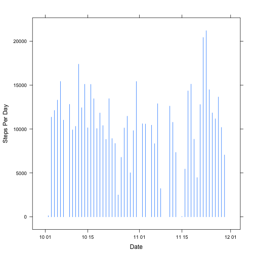
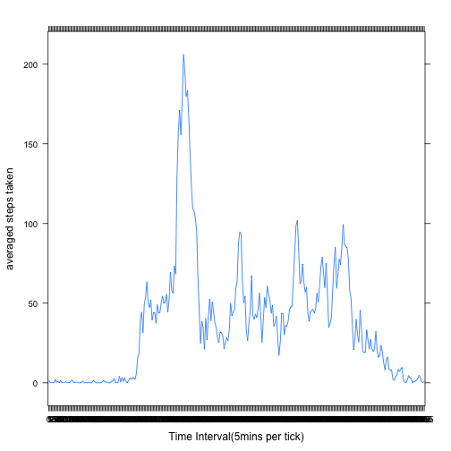
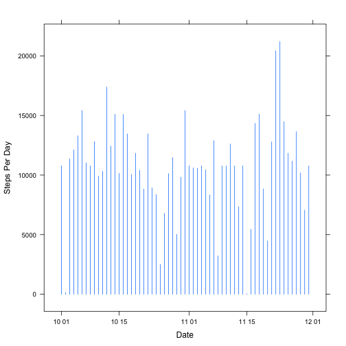
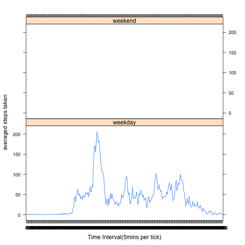

# Reproducible Research: Peer Assessment 1


## Loading and preprocessing the data
*Load the data

```r
activity <- read.csv("activity.csv")
activity$interval <- as.factor(activity$interval)
sumup <- tapply(activity$steps, activity$date, sum)
sumup <- as.data.frame(sumup)
sumup$date <- as.Date(unique(activity$date))
```


## What is mean total number of steps taken per day?

*Make Plot

```r
library(lattice)
xyplot(sumup$sumup ~ sumup$date, type = "h", xlab = "Date", ylab = "Steps Per Day")
```

 


*Calculate mean and median on daily basis

```r
mean <- mean(sumup$sumup, na.rm = TRUE)
median <- median(sumup$sumup, na.rm = TRUE)
```

The mean of total number of steps taken per day is 1.0766 &times; 10<sup>4</sup>.
The median of total number of steps taken per day is 10765.

## What is the average daily activity pattern?

*Calculate mean across all days & plot it

```r
s <- tapply(activity$steps, activity$interval, function(x) mean(x, na.rm = TRUE))
xyplot(s ~ activity$interval, type = "l", xlab = "Time Interval(5mins per tick)", 
    ylab = "averaged steps taken")
```

 

```r
max <- max(s)
```


Maximum number of steps taken in one day: 206.1698

## Imputing missing values
*Calculate total number of missing values

```r
missval <- sum(is.na(activity$steps))
```

The total number of missing values is 2304

*Replace all the missing values with average steps taken by interval

```r
for (i in 1:nrow(activity)) {
    if (is.na(activity$steps[i])) {
        activity$steps[i] <- s[which(rownames(s) == activity$interval[i])]
    }
}
```

Here's brief intro to this for loop: it tells if we find a missing value,  
look up its time interval and find the corresponding averaged steps taken,  
and then assign it the value.  

*Make Plot after imputing missing values

```r
sumup <- tapply(activity$steps, activity$date, sum)
sumup <- as.data.frame(sumup)
sumup$date <- as.Date(unique(activity$date))
xyplot(sumup$sumup ~ sumup$date, type = "h", xlab = "Date", ylab = "Steps Per Day", 
    )
```

 


*Calculate mean and median on daily basis after imputing missing values

```r
mean <- mean(sumup$sumup, na.rm = TRUE)
median <- median(sumup$sumup, na.rm = TRUE)
```

The new mean of total number of steps taken per day is 1.0766 &times; 10<sup>4</sup>.
The new median of total number of steps taken per day is 1.0766 &times; 10<sup>4</sup>.

Apparently these mean and median are not different from what we've calculated before.

## Are there differences in activity patterns between weekdays and weekends?
*Create new columns indicating weekdays or weekends

```r
activity$date <- as.Date(activity$date)
activity$type <- NA
for (i in 1:nrow(activity)) {
    if (weekdays(activity$date[i]) == "周六" || weekdays(activity$date[i]) == 
        "周日") {
        activity$type[i] <- "weekend"
    } else {
        activity$type[i] <- "weekday"
    }
}
```


*Create plot

```r
s <- tapply(activity$steps, activity$interval, mean)
xyplot(s ~ activity$interval | activity$type, type = "l", xlab = "Time Interval(5mins per tick)", 
    ylab = "averaged steps taken", layout = c(1, 2))
```

 


